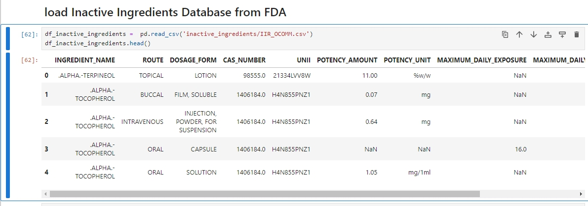
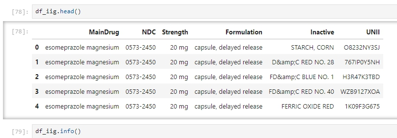
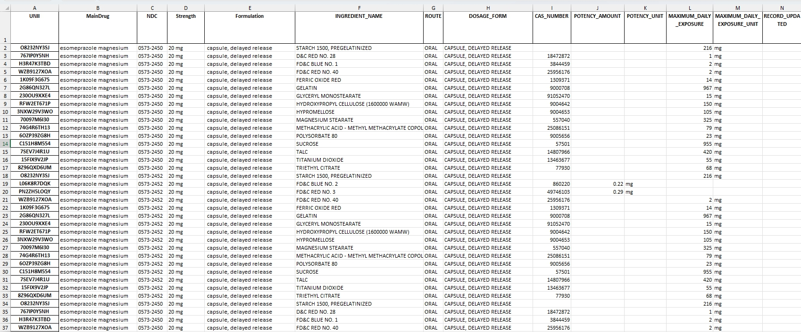

# PharmApp - Drug Discovery and Development
Copyright 2024 | Nghiên Cứu Thuốc | RD Pharma Plus

Email: nghiencuuthuoc@gmail.com | Web: http://www.nghiencuuthuoc.com

See more: https://twitter.com/nghiencuuthuoc | https://facebook.com/nghiencuuthuoc

# PharmApp-IIG-Formula-Notebooks
PharmApp-IIG-Formula-Notebooks part of the PharmApo project.

#### Notebooks for get inactive ingredients DailyMed and join with inactive ingredients database from FDA. Export data Formulation to excel or csv. useful for development formulation
#### Current run with name drug Nexium (esomeprazole magnesium) - AstraZeneca manufacture.

## 1. Load Inactive Ingredients Database from FDA 

## 2. Get inactive ingredients from Dailymed

## 3. Export data formulation to Excel
#### View file Nexium in excel

## 4. [Run PharmApp-IIG-Formula-Notebooks](https://github.com/nghiencuuthuoc/PharmApp-IIG-Formula-Notebooks/blob/main/PharmApp-IIG-Formula-Notebooks.ipynb)
